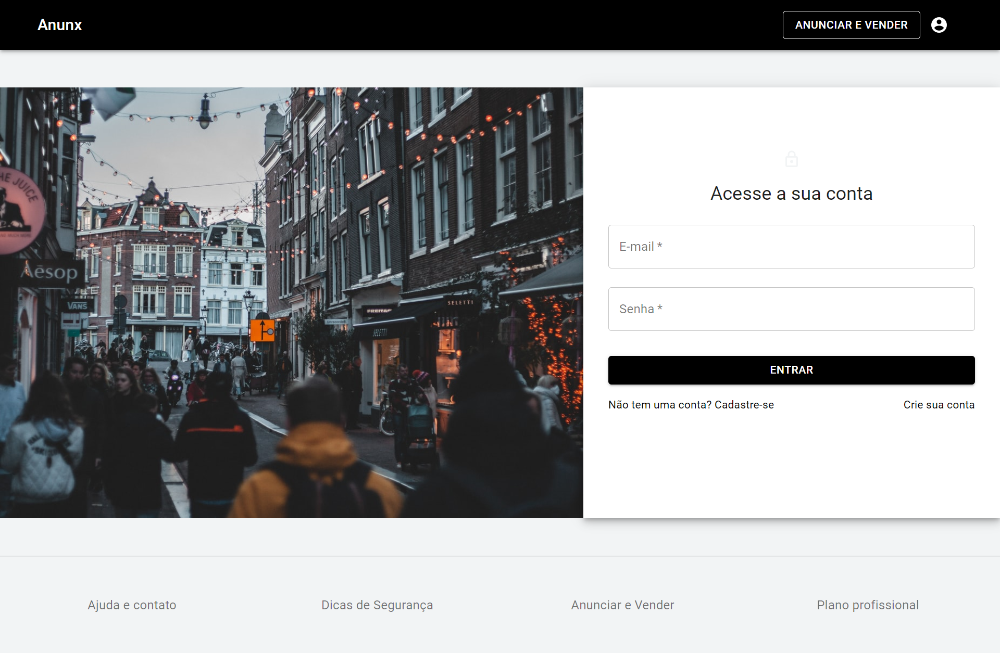

<h1>
    
</h1>

<h1 align="center">Anunx</h1>

The project is an e-commerce created with the intention of putting into practice some tools

### Features

- [ ] Home
- [ ] List
- [ ] Product 
- [ ] Publish
- [ ] Dashboard
- [ ] Signup
- [ ] Signin

### 🛠 Technologies

The following tools were used in the construction of the project:

- [JavaScript](https://www.javascript.com/)
- [Node.js](https://nodejs.org/en/)
- [React](https://pt-br.reactjs.org/)
- [Next.js](https://nextjs.org/)
- [MATERIAL-UI](https://v4.mui.com/)
- [React-dropzone](https://react-dropzone.js.org/)
- [React-material-ui-carousel](https://learus.github.io/react-material-ui-carousel/)
- [Formik](https://formik.org/)
- [Yup](https://github.com/jquense/yup)
- [Axios](https://axios-http.com/docs/intro)
- [Bcrypt](https://www.npmjs.com/package/bcrypt)

### Autor
---

 
  
 <b>Claiton Silva</b></a> 

